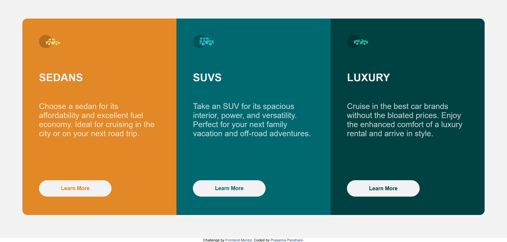

# Frontend Mentor - 3-column preview card component solution

This is a solution to the [3-column preview card component challenge on Frontend Mentor](https://www.frontendmentor.io/challenges/3column-preview-card-component-pH92eAR2-). Frontend Mentor challenges help you improve your coding skills by building realistic projects. 

## Table of contents

- [Overview](#overview)
  - [The challenge](#the-challenge)
  - [Screenshot](#screenshot)
  - [Links](#links)
- [My process](#my-process)
  - [Built with](#built-with)
  - [What I learned](#what-i-learned)
  - [Continued development](#continued-development)
  - [Useful resources](#useful-resources)
- [Author](#author)
- [Acknowledgments](#acknowledgments)

## Overview

### The challenge

Users should be able to:

- View the optimal layout depending on their device's screen size
- See hover states for interactive elements

### Screenshot


 - Screenshot of the project

### Links

- Live Site URL: [Live Server URL](https://prasannapandhare.github.io/3-column-preview-card.github.io/)

## My process

### Built with

- Semantic HTML5 markup
- CSS custom properties
- Flexbox
- CSS Grid
- Mobile-first workflow

### What I learned

I have learned how to make simple templates using HTML and CSS with help of flex properties and grid properties .

Observe below code for given project.

```html
<!DOCTYPE html>
<html lang="en">

<head>
    <meta charset="UTF-8">
    <meta name="viewport" content="width=device-width, initial-scale=1.0">
    <link rel="icon" type="image/png" sizes="32x32" href="./images/favicon-32x32.png">
    <link rel="stylesheet" href="style.css">
    <title>Frontend Mentor | 3-column preview card component</title>
</head>

<body>

    <div id="wrapper">
        <div class="container">
            <div class="card">
                <div class="car sedan">
                    <div class="top">
                        
                    </div>
                    <div class="mid">
                        <div class="name">
                            <b>Sedans</b>
                        </div>
                        <div class="data">
                            <p>
                                Choose a sedan for its affordability and excellent fuel economy. Ideal for cruising in
                                the city
                                or on your next road trip.
                            </p>
                        </div>
                    </div>
                    <div class="last">
                        <div class="button">
                            <button>Learn More</button>
                        </div>
                    </div>
                </div>
                <div class="car suv">
                    <div class="top">
                        
                    </div>
                    <div class="mid">
                        <div class="name">
                            <b>Suvs</b>
                        </div>
                        <div class="data">
                            <p>
                                Take an SUV for its spacious interior, power, and versatility. Perfect for your next
                                family vacation
                                and off-road adventures.
                            </p>
                        </div>
                    </div>
                    <div class="last">
                        <div class="button">
                            <button>Learn More</button>
                        </div>
                    </div>
                </div>
                <div class="car lux">
                    <div class="top">
                        
                    </div>
                    <div class="mid">
                        <div class="name">
                            <b>Luxury</b>
                        </div>
                        <div class="data">
                            <p>
                                Cruise in the best car brands without the bloated prices. Enjoy the enhanced comfort of
                                a luxury
                                rental and arrive in style.
                            </p>
                        </div>
                    </div>
                    <div class="last">
                        <div class="button">
                            <button>Learn More</button>
                        </div>
                    </div>
                </div>
            </div>
        </div>
    </div>

    <div class="attribution">
        Challenge by <a href="https://www.frontendmentor.io?ref=challenge" target="_blank">Frontend Mentor</a>.
        Coded by <a href="#">Prasanna Pandhare</a>.
    </div>
</body>

</html>
```
```css
@import url(https://fonts.google.com/specimen/Lexend+Deca);
@import url(https://fonts.google.com/specimen/Big+Shoulders+Display);

* {
    margin: 0;
    padding: 0;
    box-sizing: border-box;
    font-family: "Lexend Deca", sans-serif;
    /* font-weight: 400; */
    font-family: "Big Shoulders Display", sans-serif;
    /* font-weight: 700; */
}

#wrapper {
    width: 100%;
    height: 100vh;
    background-color: hsl(0, 0%, 95%);
    display: flex;
    justify-content: center;
    align-items: center;
}

.card {
    width: 1400px;
    height: 60%;
    display: grid;
    grid-template-columns: 33.33% 33.33% 33.34%;
    border-radius: 15px;
    overflow: hidden;
}

.car {
    width: 100%;
    height: 100%;
    padding: 50px;
}

.sedan {
    background-color: hsl(31, 77%, 52%);
}

.suv {
    background-color: hsl(184, 100%, 22%);
}

.lux {
    background-color: hsl(179, 100%, 13%);
}

.top {
    height: 15%;
    width: 15%;
}

.mid {
    padding-top: 10%;
    padding-bottom: 20%;
    display: flex;
    flex-direction: column;
    gap: 20%;
}

.name {
    color: hsl(0, 0%, 95%);
    text-transform: uppercase;
    font-family: "Lexend Deca", sans-serif;
    font-weight: 400;
    font-size: xx-large;
    padding-bottom: 15%;
}

.data {
    font-size: 150%;
    font-weight: lighter;
}

p {
    color: hsla(0, 0%, 100%, 0.75);
}

.button {
    padding-top: 15%;
    padding-bottom: 10%;
}

button {
    border: none;
    border-radius: 50px;
    width: 60%;
    height: 50px;
    background-color: hsl(0, 0%, 95%);
    cursor: pointer;
    font-weight: bolder;
    font-size: 16px;
}

.sedan button {
    color: hsl(31, 77%, 52%);
}

.suv button {
    color: hsl(184, 100%, 22%);
}

.lux button {
    color: hsl(179, 100%, 13%);
}

button:hover {
    border-radius: 30px;
    border: 2px solid hsl(0, 0%, 95%);
    color: hsl(0, 0%, 95%);
}

.sedan button:hover {
    background-color: hsl(31, 77%, 52%);
}

.suv button:hover {
    background-color: hsl(184, 100%, 22%);
}

.lux button:hover {
    background-color: hsl(179, 100%, 13%);
}

.attribution {
    font-size: 11px;
    text-align: center;
}

.attribution a {
    color: hsl(228, 45%, 44%);
    text-decoration: none;
}


@media screen and (width<=526px) {
    #wrapper {
        display: flex;
        flex-direction: column;
        justify-content: center;
        align-items: center;
        min-width: 375px;
        height: 100%;
        padding-left: 10%;
        padding-top: 100px;
        padding-bottom: 100px;
    }

    .card {
        height: 90%;
        width: 90%;
        display: grid;
        grid-template-columns: 100%;
        grid-template-rows: 33.33%, 33.33%, 33.34%;
    }

    .attribution {
        text-align: center;
        font-size: 9px;
    }
}

@media screen and (width<=375px) {

    #wrapper {
        display: flex;
        flex-direction: column;
        justify-content: center;
        align-items: center;
        min-width: 375px;
        height: 100%;
        padding-left: 10%;
        padding-top: 100px;
        padding-bottom: 100px;
    }

    .card {
        height: 90%;
        width: 90%;
        display: grid;
        grid-template-columns: 100%;
        grid-template-rows: 33.33%, 33.33%, 33.34%;
    }

    .attribution {
        text-align: center;
        font-size: 4px;
    }

}
```

### Continued development

I am trying to improve my skills in media queries.

### Useful resources

- [MDN Docs](https://developer.mozilla.org/en-US/) - Helped me in various learnings. 

## Author

- Website - [Prasanna Pandhare](https://www.your-site.com)
- Frontend Mentor - [@Prasannapandhare](https://www.frontendmentor.io/profile/Prasannapandhare)

## Acknowledgments

I understood the importance of CSS in designing HTML structure.
As well as understood about responsive websites.
